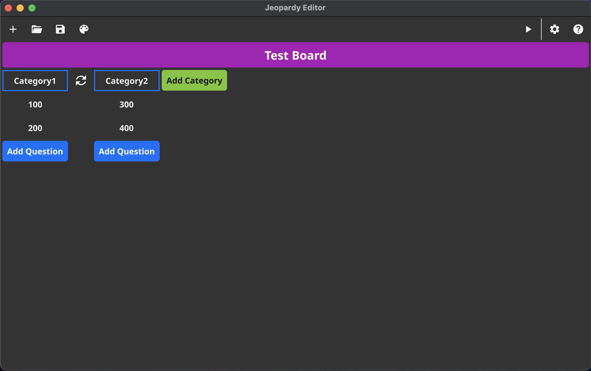

# jeopardy

A Jeopardy GUI for creating and running Jeopardy-like games, implemented in Go

Users can create, load, save, and manipulate games within the editor. Once they are satisfied, they can click the "Run" button to enter an interactive simulation of the game, allowing them to play it without any extra work.
